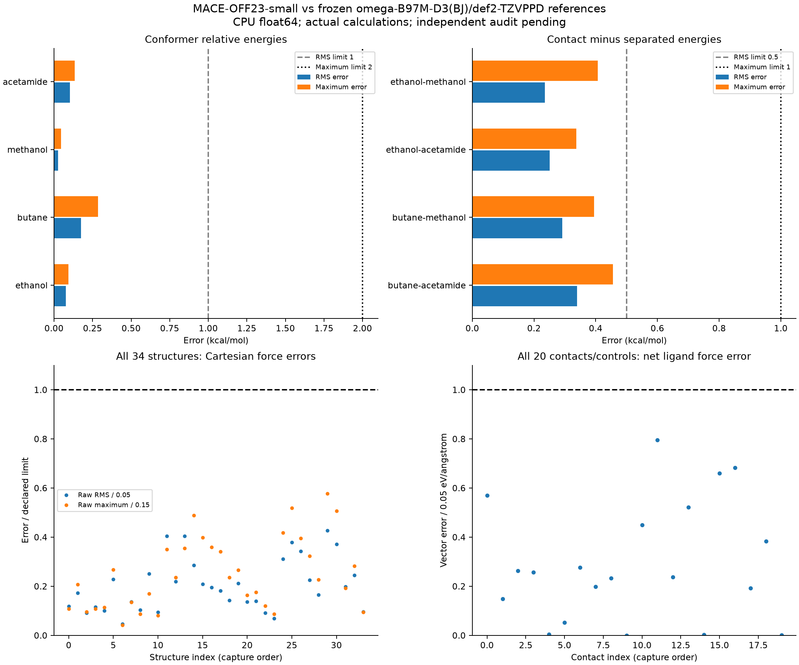

# G05 actual chemical-reference results

All 46 required quantum calculations, all 12 numerical controls and both G05-T4 chemical checks passed. This is worker evidence; independent full-G05 audit and gate acceptance remain pending.

The unchanged academic MACE-OFF23-small checkpoint uses CPU float64, Default head and total `energy`. The references are restricted omega-B97M-D3(BJ)/def2-TZVPPD with Psi4 1.10.2/LibXC 7.0.0 and frozen basis/settings hashes. The 34 exact inputs are neutral singlet C/H/N/O structures. A contacting pair is evaluated as one joint graph.

Matching the named training-reference level establishes neither identical training numerics nor that these inputs were absent from training. These results cover the frozen small nonperiodic capped systems; broader chemistry, GPU, periodic/electrostatic physics, protein binding and ABFE/RBFE remain unqualified.

## Energy errors

| Conformer family | RMS (kcal/mol) | Maximum (kcal/mol) |
|---|---:|---:|
| ethanol | 0.075540 | 0.092999 |
| butane | 0.175964 | 0.286225 |
| methanol | 0.025920 | 0.044811 |
| acetamide | 0.103955 | 0.133639 |

Declared conformer limits: RMS 1 and maximum 2 kcal/mol. Zeros are the frozen within-composition family baselines.

| Contact family | Interaction RMS | Interaction maximum | Contact-minus-separated RMS | Contact-minus-separated maximum |
|---|---:|---:|---:|---:|
| butane-acetamide | 0.338725 | 0.455604 | 0.339018 | 0.455940 |
| butane-methanol | 0.292485 | 0.396334 | 0.291585 | 0.395310 |
| ethanol-acetamide | 0.244320 | 0.325143 | 0.250456 | 0.336708 |
| ethanol-methanol | 0.239610 | 0.413439 | 0.234812 | 0.407067 |

All contact errors are kcal/mol; limits are RMS 0.5 and maximum 1. Interaction energies use the exact-coordinate uncorrected supermolecule-minus-monomers convention. Separated comparisons use identical composition; no absolute cross-composition energy comparison is made.

## Force and numerical-control maxima

| Check | Observed maximum | Declared limit |
|---|---:|---:|
| Raw component RMS (eV/angstrom) | 0.02132608 | 0.05 |
| Raw atom-vector error (eV/angstrom) | 0.08661314 | 0.15 |
| Projected full-parent component RMS (eV/angstrom) | 0.01451447 | 0.05 |
| Projected full-parent atom-vector error (eV/angstrom) | 0.08661314 | 0.15 |
| Net ligand interaction-force vector error (eV/angstrom) | 0.03976290 | 0.05 |
| Numerical-control energy (kcal/mol) | 0.000058057 | 0.02 |
| Numerical-control force RMS (eV/angstrom) | 0.000046777 | 0.002 |
| Numerical-control atom-vector force (eV/angstrom) | 0.000223414 | 0.005 |

All 7 required attraction signs and 4 compressed repulsion signs passed. Every contact, including weak contacts, is retained in [the sign table](contact-sign-checks.csv).

Both cap-parent derivatives and all ligand forces are retained. [Full cap/parent force evidence](cap-parent-force-evidence.json) reconstructs the independent oracle projections and agrees with captured test metrics to 1e-12 eV/angstrom; this is report analysis, not another production force projection.

## Runtime and reproducibility

The 38 resumed workers all exited zero. Eight historical records were reused by exact SHA-256; their coordinator exit statuses were not invented. The cumulative debit is 4.400612 h including 0.652804 h for the prior launch-to-stop interval. The resumed session used 3.747808 h, two threads and 3 GiB Psi4 memory under the approved 5 GiB allocation cap. Maximum new-worker RSS was 4.670959 GiB. Total cgroup usage includes cache and reached its 8 GiB cap; zero OOM/OOM-kill events were recorded. Every private scratch directory was cleaned after saving its record/receipt.

All 46 actual Psi4 logs explicitly record energy/wavefunction convergence. See [job identities and timings](quantum-job-summary.csv), [all 34 row metrics](chemical-row-metrics.csv), [all 12 numerical controls](quantum-numerical-controls.csv), [raw comparison captures](chemical-comparisons/) and [bundle validation](quantum-bundle-validation.json). Record/input/source hashes and immutable job orders/receipts are retained with the complete generation attempt.

The [PDF figure](chemical-reference-results.pdf) is exportable. The source suite and audit handoff are recorded in the [worker log](../../Gate_05_v4_worker.md).
